```{r setup, include = FALSE, cache = FALSE, message = FALSE}
## set some knitr options
library(knitr)
library(here)
# ## Figure settings, defaults to png files
opts_chunk$set(fig.align='center', fig.width = 16/4,
               fig.height = 9/4, fig.show = 'hold', par = TRUE,
               dev='png',
               dpi=72*4, out.width = "80%")

colorize <- function(x, color) {
  if (knitr::is_latex_output()) {
    sprintf("\\textcolor{%s}{%s}", color, x)
  } else if (knitr::is_html_output()) {
    sprintf("<span style='color: %s'>%s</span>", color,
      x)
  } else x
}

hl <- function(x) {
  colorize(x, color = "corals2")
}
# 
# ## the "picture in picture" type of formatting
# knitr::opts_hooks$set(fig.callout = function(options) {
#   if (options$fig.callout) {
#     options$echo <- FALSE
#     options$out.height <- "99%"
#     options$fig.width <- 16
#     options$fig.height <- 8
#   }
#   options
# })
```


# Getting started 


First, we need to make sure you have setup an [RStudio project with gitHub](/jtipton25/post/setting-up-git-with-r-and-rstudio/). Once you have set this up, we can get started with creating the blog.


# Blogdown


This tutorial will walk you through the steps of building your own blog using blogdown and gitHub actions. By then end, you will have a website and blog


First, make sure the `blogdown` and `usethis` packages are installed on your machine

```r
install.packages("usethis")
install.packages("blogdown")
```


    
# Choosing a theme


# Adding content to the blog

# Using the renv package to manage R package dependencies


# `blogdown` and gitHub

* Setting up a blog is easy using the `R` package blogdown


# Building your blog with gitHub actions

GitHub actions are a great way to use continuous integration tools to automatically build and host the website using gitHub pages. A nice benefit of using gitHub actions is that everything for your blog is contained within a single hosted environment. 

The key to using gitHub actions is to setup a folder heirarchy. In the blogdown project folder, create a folder `.github` that has file named `.gitignore` that contains the text `*.html`. Also in the `.github` folder, create a folder named `workflows` that has a file named `deploy_blogdown.yml`. The file `deploy_blogdown.yml` is the file that tells the gitHub servers how to build your website. I'll go through the instructions from `deploy_blogdown.yml` in detail first, then post the full contents of `deploy_blogdown.yml` at the end of this section.

The gitHub actions file `deploy_blogdown.yml` begins with

```
on:
  push:
     branches:
       - master
```
which tells the server to run this action on any pushes to the master branch. As gitHub is moving from `master` to `main` as the default branch name, this might need to be modified to replace `master` with `main`.

In the gitHub actions script `deploy_blogdown.yml`, there are two major jobs. The first job builds the blog from the source files (.Rmd and other files) and saves the output of the build as a gitHub artifact (saved output files). The second job takes the contents of the build artifact (output files) and pushes these to a gitHub pages branch of the github repository that hosts the blog through gitHub pages.

Here we introduce the section that runs the job named `deployblog` which builds the site. 
```
name: deployblog

jobs:
  blogdown:
    name: Render-Blog
    runs-on: macOS-latest
    steps:
      - uses: actions/checkout@v1
      - uses: r-lib/actions/setup-r@v1
      - uses: r-lib/actions/setup-pandoc@v1
      - name: Install rmarkdown
        run: Rscript -e 'install.packages(c("rmarkdown","blogdown"))'
      - name: install hugo
        run: Rscript -e 'blogdown::install_hugo("0.81.0")'
      - name: Render blog
        run: Rscript -e 'blogdown::build_site()'
      - uses: actions/upload-artifact@v1
        with:
          name: public
          path: public/
          
```
The bit (`name:deployblog`) names the action. The section
```
jobs:
  blogdown:
    name: Render-Blog
    runs-on: macOS-latest
``` 
creates a job with the `job_id` of `blogdown` and the job name `Render-Blog`. The `runs-on: macOS-latest` tells the server to create a macOS virtual machine for the job. One can also run jobs on a virtual Windows or Linux OS if desired.

The next sections define the sequence of individual tasks within the job. The following sections have instructions for installing necessary software for the virtual machine, including `R`  and `pandoc` for knitting the blog.
```
    steps:
      - uses: actions/checkout@v1
      - uses: r-lib/actions/setup-r@v1
      - uses: r-lib/actions/setup-pandoc@v1
```

The next set of steps run the `R` code to install necessary `R` packages and then build the blog
```
      - name: Install rmarkdown
        run: Rscript -e 'install.packages(c("rmarkdown","blogdown"))'
      - name: install hugo
        run: Rscript -e 'blogdown::install_hugo("0.81.0")'
      - name: Render blog
        run: Rscript -e 'blogdown::build_site()'
```
The final section of the first job uploads the results from the final build as an artifact (set of files) that will then be pushed to the gitHub pages branch of the repository
```
      - uses: actions/upload-artifact@v1
        with:
          name: public
          path: public/
```


The second job in `deploy_blogdown.yml` takes the output of the built blog and pushes the build files to a gitHub pages branch. This section assumes that, prior to the first build using continuous integration, an empty gitHub pages branch `gh-pages` has been created. Instructions on how to do this step are in the blog at **link here**.


```
# Need to first create an empty gh-pages branch
# see https://pkgdown.r-lib.org/reference/deploy_site_github.html
# and also add secrets for a GH_PAT and EMAIL to the repository
# gh-action from Cecilapp/GitHub-Pages-deploy
  checkout-and-deploy:
   runs-on: ubuntu-latest
   needs: blogdown
   steps:
     - name: Checkout
       uses: actions/checkout@master
     - name: Download artifact
       uses: actions/download-artifact@v1.0.0
       with:
         # Artifact name
         name: public # optional
         # Destination path
         path: public # optional
     - name: Deploy to GitHub Pages
       uses: Cecilapp/GitHub-Pages-deploy@master
       env:
          GITHUB_TOKEN: ${{ secrets.GH_PAT }} # https://github.com/settings/tokens
       with:
          email: ${{ secrets.EMAIL }}               # must be a verified email
          build_dir: public/                     # "_site/" by default
```

The full contents of `deploy_blogdown.yml` are below:


```
on:
  push:
     branches:
       - master


name: deployblog

jobs:
  blogdown:
    name: Render-Blog
    runs-on: macOS-latest
    steps:
      - uses: actions/checkout@v1
      - uses: r-lib/actions/setup-r@v1
      - uses: r-lib/actions/setup-pandoc@v1
      - name: Install rmarkdown
        run: Rscript -e 'install.packages(c("rmarkdown","blogdown"))'
      - name: install hugo
        run: Rscript -e 'blogdown::install_hugo("0.81.0")'
      - name: Render blog
        run: Rscript -e 'blogdown::build_site()'
      - uses: actions/upload-artifact@v1
        with:
          name: public
          path: public/

# Need to first create an empty gh-pages branch
# see https://pkgdown.r-lib.org/reference/deploy_site_github.html
# and also add secrets for a GH_PAT and EMAIL to the repository
# gh-action from Cecilapp/GitHub-Pages-deploy
  checkout-and-deploy:
   runs-on: ubuntu-latest
   needs: blogdown
   steps:
     - name: Checkout
       uses: actions/checkout@master
     - name: Download artifact
       uses: actions/download-artifact@v1.0.0
       with:
         # Artifact name
         name: public # optional
         # Destination path
         path: public # optional
     - name: Deploy to GitHub Pages
       uses: Cecilapp/GitHub-Pages-deploy@master
       env:
          GITHUB_TOKEN: ${{ secrets.GH_PAT }} # https://github.com/settings/tokens
       with:
          email: ${{ secrets.EMAIL }}               # must be a verified email
          build_dir: public/                     # "_site/" by default
```


<!-- # Setting up your Netlify account -->

<!-- * This section follows the instructions [here](https://bookdown.org/yihui/blogdown/netlify.html) -->

<!-- * Go to [https://www.netlify.com/](https://www.netlify.com/) and sign up for a free account using your gitHub account -->

<!-- * Follow the screenshots and instructions to link your gitHub account to Netlify -->

<!-- * Create a new site from git (green button in left figure) -->

<!-- ```{r, echo = FALSE, out.width = "50%", fig.show = 'hold', fig.align = "default"} -->
<!-- knitr::include_graphics("./images/netlify-1.png") -->
<!-- 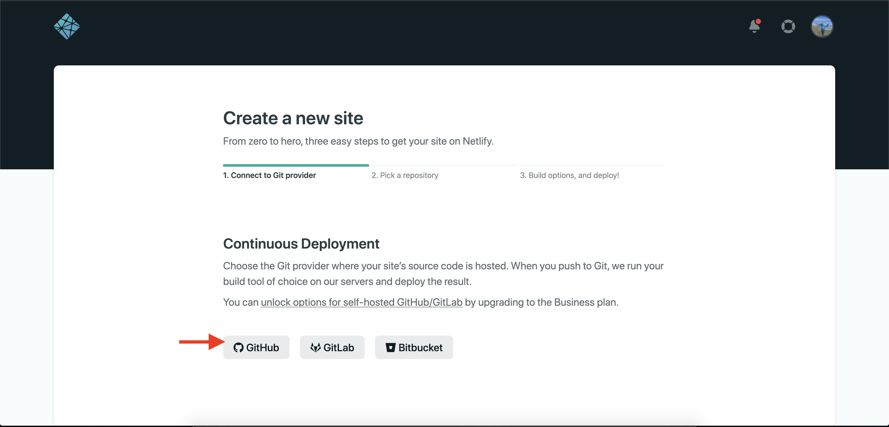 -->
<!-- ``` -->

<!-- * Then choose to link to your gitHub account (gitHub button in right figure) -->


<!-- # Setting up your Netlify account -->

<!-- * Search for your gitHub repository (left figure) -->

<!-- * If you can't find your repository, click the configure repository button (right figure) -->

<!-- ```{r, echo = FALSE, out.width = "50%", fig.show = 'hold', fig.align = "default"} -->
<!-- 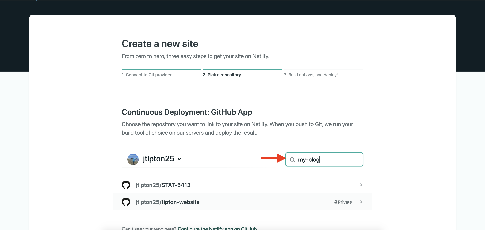 -->
<!-- 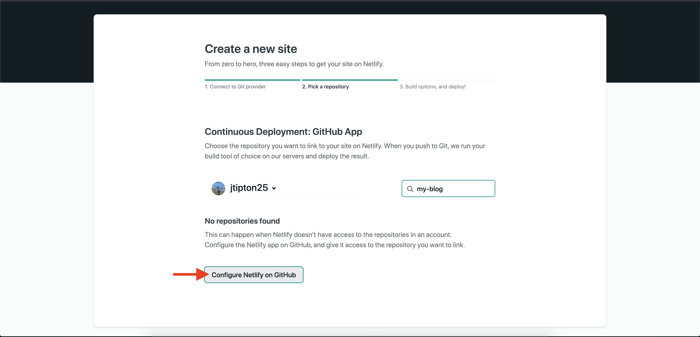 -->
<!-- ``` -->


<!-- # Setting up your Netlify account -->

<!-- * If you have multiple gitHub accounts/teams, you have to choose your correct gitHub account -->

<!-- ```{r, echo = FALSE, out.width = "30%", fig.show = 'hold', fig.align = "center"} -->
<!-- 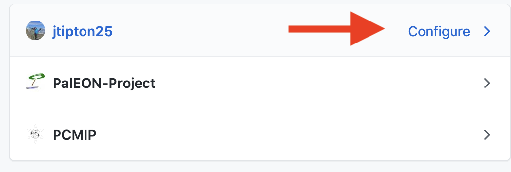 -->
<!-- ``` -->

<!-- * I have chosen to only link certain repositories with Netlify. If you choose this option, click on the button to choose those repositories. Otherwise, you can share all your repositories with Netlify -->

<!-- ```{r, echo = FALSE, out.width = "70%", fig.show = 'hold', fig.align = "center"} -->
<!-- 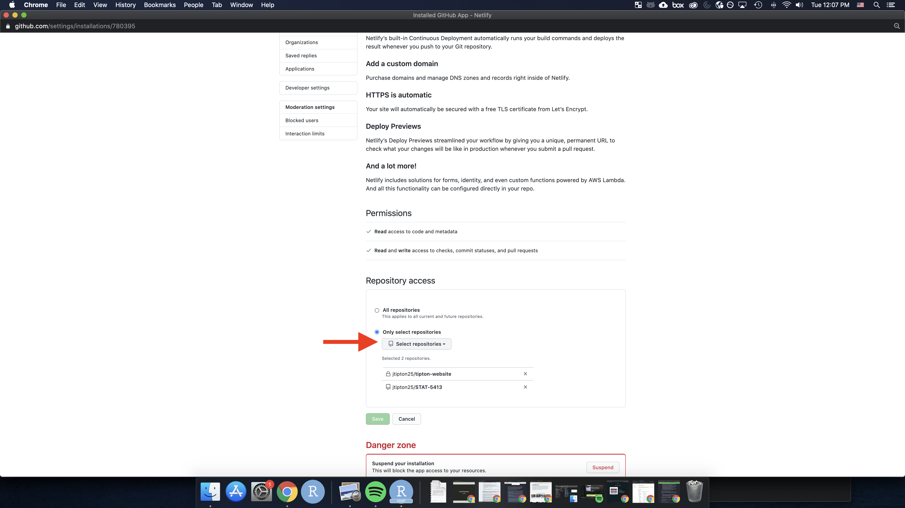 -->
<!-- ``` -->


<!-- # Setting up your Netlify account -->

<!-- * If choosing to share only specific repositories, choose those repositories here. Make sure you choose the blog repository we just created. -->

<!-- ```{r, echo = FALSE, out.width = "50%", fig.show = 'hold', fig.align = "default"} -->
<!-- 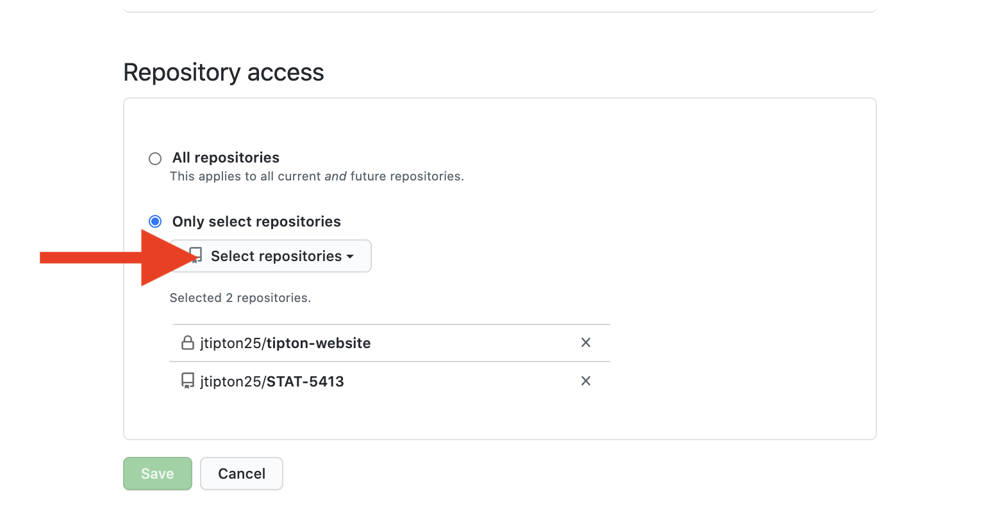 -->
<!-- 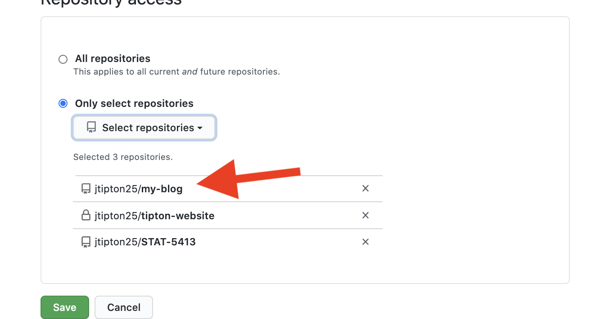 -->
<!-- ``` -->


<!-- # Setting up your Netlify account -->

<!-- * Once you have chosen your linked repositories, you can choose on Netlify which repositories to build into a website (left figure). Once you have chosen the website you want to build, you can deploy the site (right figure) -->

<!-- ```{r, echo = FALSE, out.width = "50%", fig.show = 'hold', fig.align = "default"} -->
<!-- 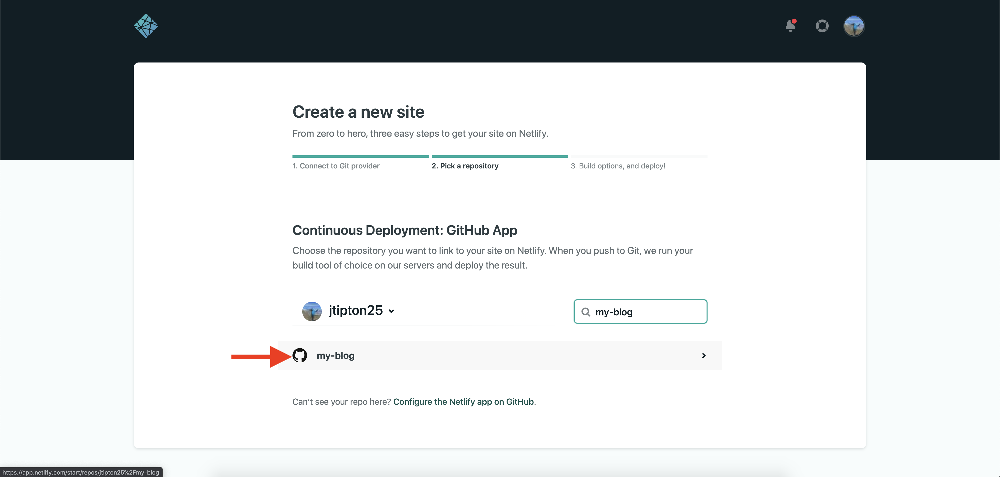 -->
<!-- knitr::include_graphics("./images/netlify-10.png") -->
<!-- ``` -->


<!-- # Setting up your Netlify account -->

<!-- * This will take you to your deployed site (left). Once the site has built, you can view the site link using the link at the top (right) -->

<!-- ```{r, echo = FALSE, out.width = "50%", fig.show = 'hold', fig.align = "default"} -->
<!-- 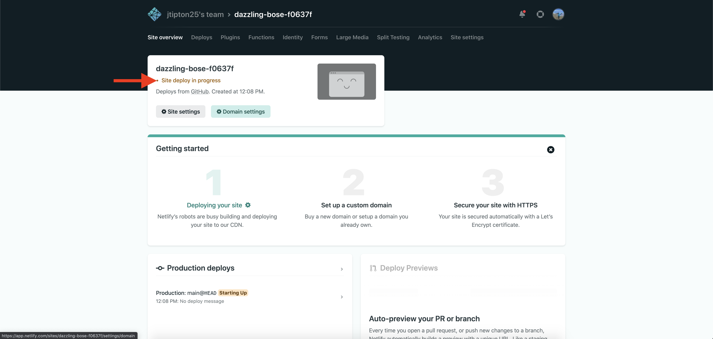 -->
<!-- 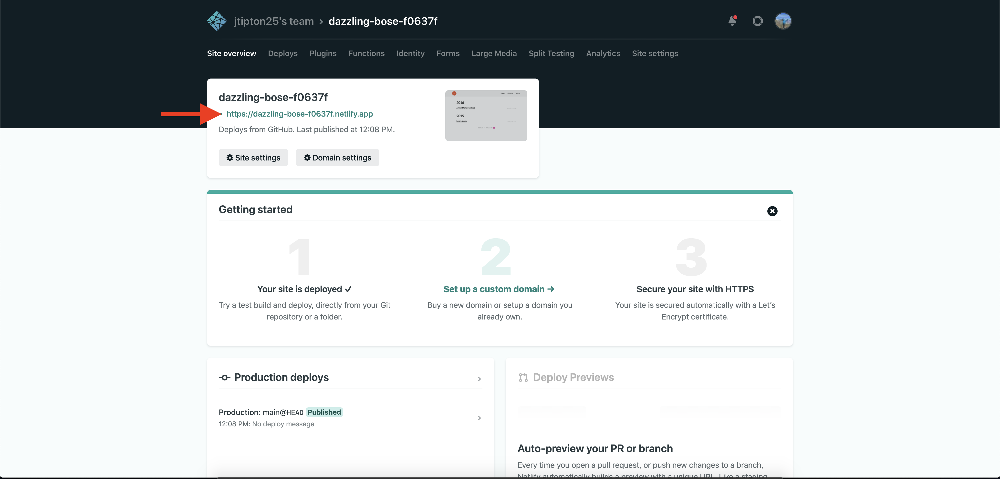 -->
<!-- ``` -->


<!-- # Setting up your Netlify account -->

<!-- * To change the blog address, we can edit the domain. Click on the Domain settings button (left). Then click the options button and edit site name.  -->

<!-- ```{r, echo = FALSE, out.width = "50%", fig.show = 'hold', fig.align = "default"} -->
<!-- 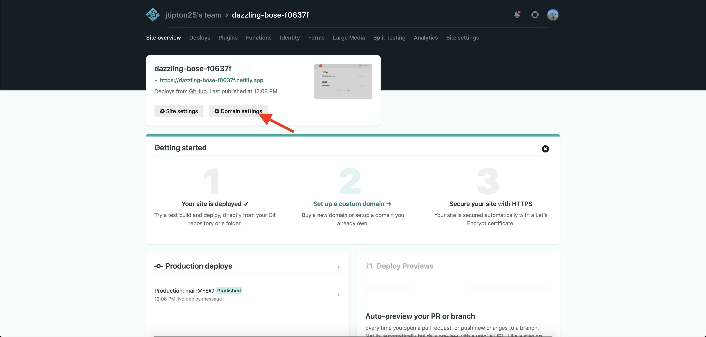 -->
<!-- 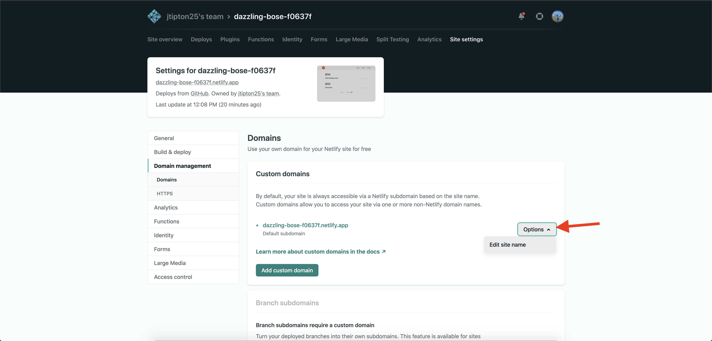 -->
<!-- ``` -->

<!-- * Change the site name to something that you prefer -->

<!-- ```{r, echo = FALSE, out.width = "50%", fig.show = 'hold', fig.align = "center"} -->
<!-- knitr::include_graphics("./images/netlify-15.png") -->
<!-- ``` -->

<!-- * The blog for this walkthrough is at [https://dasc-1104-blog.netlify.app/](https://dasc-1104-blog.netlify.app/) -->


# Editing the blog

* Awesome! We have a live blog. Now, all you have to do is make changes on the server, push them to gitHub, and then wait for Netlify to deploy the changes for your blog to automatically update.

* Adding a `.Rproj` file to the blog
    * In Rstudio, go "File - New Project". If prompted, don't save the RData.
    * 
    
```{r, echo = FALSE, out.width = "50%", fig.show = 'hold', fig.align = "center"}
knitr::include_graphics("./images/project-1.png")
```


# Editing the blog

* Choose an existing directory (left) and click browse to find the cloned repository (right)

```{r, echo = FALSE, out.width = "50%", fig.show = 'hold', fig.align = "default"}
knitr::include_graphics("./images/project-2.png")
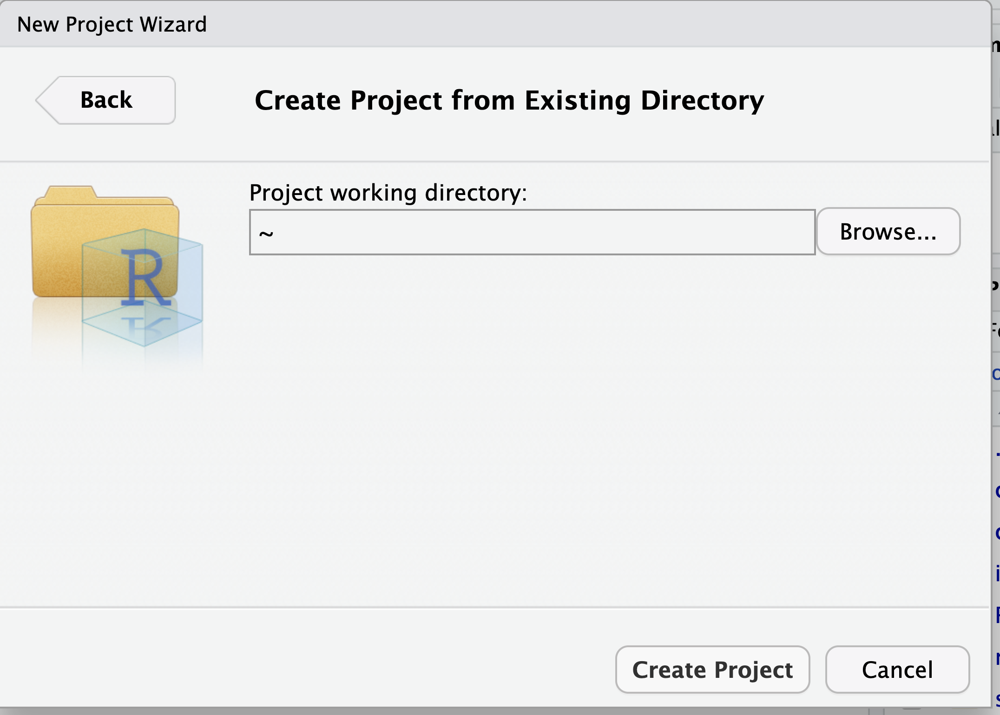
```


# Editing the blog

* Choose the cloned repository folder (left) and create the project in this repository (right)

```{r, echo = FALSE, out.width = "50%", fig.show = 'hold', fig.align = "default"}
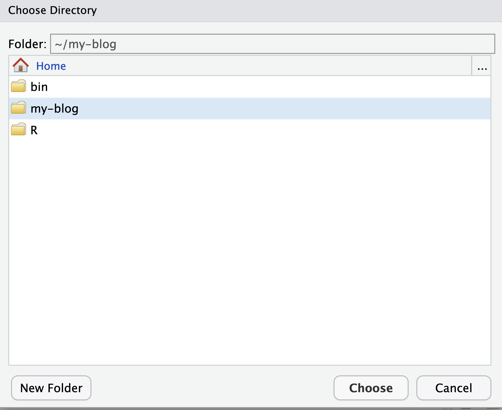
knitr::include_graphics("./images/project-5.png")
```


# Editing the blog

* RStudio should then start a new session with your blog project loaded

```{r, echo = FALSE, out.width = "70%", fig.show = 'hold', fig.align = "center"}
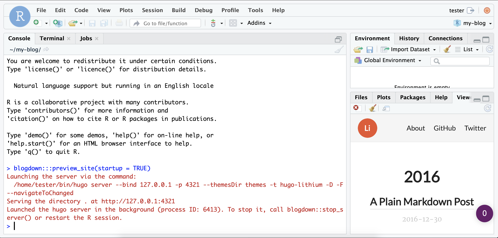
```


# Editing the blog

* Changing the site configuration

* The `config.toml` file changes global settings for your site. Let's open this file in `RStudio` and change the `title`, gitHub `url` and, if you want, your Twitter `url` (**Make sure these accounts are professional if you link to them!!!**)

* The `content` folder has a file `about.md`. Edit this file to tell us a little about yourself.


# Editing the blog

* You can update the site locally (i.e., on the server, your own computer, but not on the website) using `blogdown::serve_site()`
    * This allows "real-time" previewing of your edits
    
* You can create a new post using `blogdown::new_post(title = "A first post")`    

    * These posts live in the `content/post/` directory so you can edit them there (or delete the default posts)

* Before you push to gitHub to deploy your site, you can use `blogdown::build_site()` then push the repository to gitHub to update the site.

* More details are available at [https://bookdown.org/yihui/blogdown/](https://bookdown.org/yihui/blogdown/)


# Adding your resume to the blog

* As this is a new server, we need to install the `tinytex` package for converting a `.Rmd` file to a pdf. Type

```r
install.packages("tinytex")
```

then

```r
tinytex::install_tinytex()
```

to get this installed

* Then, copy the files from your resume repository (earlier in the semester -- particularly the files `resume-example.Rmd`, `svm-latex-resume.tex`, and `rick-martel-crop.jpg` -- or any images you added as well) to the `static` folder in your blog directory.

When I tried to compile the `.Rmd` file to pdf on the server, I got a compile error. To fix this, I ran

```r
rmarkdown::render("./static/resume-master/resume-example.Rmd")
```

where the file path was where I uploaded the `.Rmd` file for the resume.

* **Note: I needed to use the above code to compile the `.Rmd` everytime I changed my resume file**


# Adding your resume to the blog

* Next, you need to add the following to your `config.toml` file where the path of the url is the same path as where the `resume-example.Rmd` file was (without the `/static/` directory but with a leading "\"):

```
[[menu.main]]
    name = "Resume"
    url = "/resume-master/resume-example.pdf"
```

* Create a folder named `R` and add the file `build.R` that contains the following lines:

```r
blogdown::build_dir('static')
```

* This file will take the files you added to the `static` directory (your resume) and build these files for hosting on the website when you run `blogdown::build_site()`


# Adding your resume to the blog


* Now, run

```r
blogdown::build_site()
```

to build the pdf document and

```r
blogdown::serve_site()
```

to allow for interactive editing and to have your resume added to the blog

* To see your changes updated on the website, commit and push the gitHub repository.


# Adding data

* If you add data for analysis (`.csv` files), you need to tell `blogdown` to ignore the `.csv` files. To do this, open the `config.toml` file and modify the line:

```
ignoreFiles = ["\\.Rmd$", "\\.Rmarkdown$", "_cache$", "\\.knit\\.md$", "\\.utf8\\.md$"]
```

by adding `"\\.csv$"` to tell `blogdown` to ignore `.csv` files

so that the `ignoreFiles` line is now

```
ignoreFiles = ["\\.Rmd$", "\\.Rmarkdown$", "_cache$", "\\.knit\\.md$", "\\.utf8\\.md$", "\\.csv$"]
```


# Troubleshooting:  Knitting to pdf fails

* If you get the error shown below when knitting a `.Rmd` to `.pdf`, you don't have `tinytex` installed. 

```{r, echo = FALSE, out.width = "70%", fig.show = 'hold', fig.align = "center"}
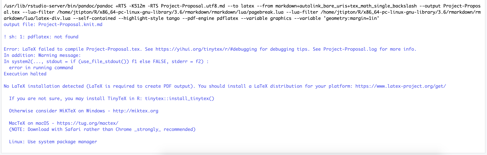
```

Run the following to resolve this issue

```{r, eval = FALSE}
install.packages("tinytex")
tinytex::install_tinytex()
```


# Troubleshooting: Knitting to pdf fails

If you get the error shown below when knitting a `.Rmd` to `.pdf`, you have a unicode character in your `.Rmd`

```{r, echo = FALSE, out.width = "30%", fig.show = 'hold', fig.align = "center"}
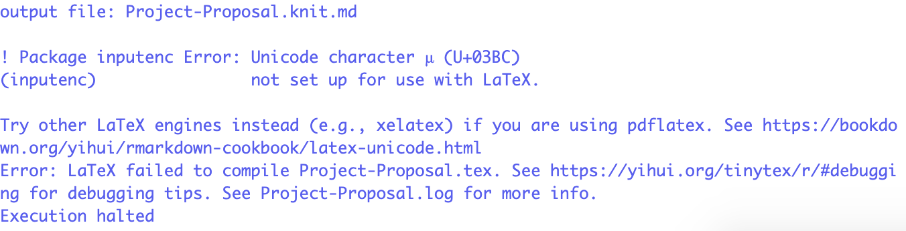
```

To find the unicode character(s), open the find bar using `ctrl-f` (`cmd-f` on Mac) or using the menu bar: `edit -> find`. Make sure the `Regex` box is checked and search for `[^\x00-\x7F]`

```{r, echo = FALSE, out.width = "65%", fig.show = 'hold', fig.align = "center"}
knitr::include_graphics("./images/unicode-find.png")
```

Find the unicode character and delete it for the `.Rmd` document to compile


# Troubleshooting: Figures don't show

* My blog site on netlify doesn't show any of my figures

In the `R` console, run 

```{r, eval = FALSE}
blogdown::build_site()
```


Then open up a terminal window and check the git status

```{bash, eval = FALSE}
git status
```

There should be some un-tracked directories that end in the folder `/figure-html/`. Add these to git using 

```{bash, eval = FALSE}
git add path/to/figure-html
```

and commit with

```{bash, eval = FALSE}
git commit -m "commit message"
```


# Troubleshooting: Netlify builds but doesn't update blog

* My blog site on netlify builds without failure but doesn't show the updated blog posts 

In the `R` console, run 

```{r, eval = FALSE}
blogdown::build_site()
```


Then open up a terminal window and check the git status

```{bash, eval = FALSE}
git status
```

There should be some un-tracked directories that end in the folder `/figure-html/`. Add these to git using 

```{bash, eval = FALSE}
git add path/to/figure-html
```

and commit with

```{bash, eval = FALSE}
git commit -m "commit message"
```


# Troubleshooting: Netlify build fails

**To Do: add screenshot of build error message** 

* If you add data for analysis (`.csv` files), you need to tell `blogdown` to ignore the `.csv` files. To do this, open the `config.toml` file and modify the line:

```
ignoreFiles = ["\\.Rmd$", "\\.Rmarkdown$", "_cache$", "\\.knit\\.md$", "\\.utf8\\.md$"]
```

by adding `"\\.csv$"` to tell `blogdown` to ignore `.csv` files

so that the `ignoreFiles` line is now

```
ignoreFiles = ["\\.Rmd$", "\\.Rmarkdown$", "_cache$", "\\.knit\\.md$", "\\.utf8\\.md$", "\\.csv$"]
```


# Troubleshooting: Netlify build fails

* If you add data for analysis (`.csv` files), the Netfliy build might fail, pointing to a `.csv` file

```{r, echo = FALSE, out.width = "100%", fig.show = 'hold', fig.align = "center"}
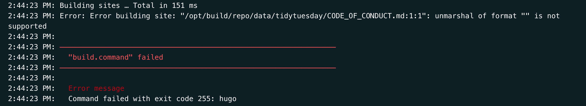
```


To fix this, you need to tell `blogdown` to ignore the `.csv` files. To do this, open the `config.toml` file and modify the line:

.small[
```
ignoreFiles = ["\\.Rmd$", "\\.Rmarkdown$", "_cache$", "\\.knit\\.md$", "\\.utf8\\.md$"]
```
]

by adding `"\\.csv$"` to tell `blogdown` to ignore `.csv` files

so that the `ignoreFiles` line is now

.small[
```
ignoreFiles = ["\\.Rmd$", "\\.Rmarkdown$", "_cache$", "\\.knit\\.md$", "\\.utf8\\.md$", "\\.csv$"]
```
]


# Troubleshooting: Netlify tidytuesday error

* If you moved data from tidytuesday into your blog repository, the netlify build might fail with the following error message.

```{r, echo = FALSE, out.width = "100%", fig.show = 'hold', fig.align = "center"}

```

* If you added the tidytuesday repository analysis you need to tell `blogdown` to ignore the `.csv` files. To do this, open the `config.toml` file and modify the line:

```
ignoreFiles = [..., "\\.csv$"]
```

where the `...` is all the current values in this list . Then add `"tidytuesday"` to tell `blogdown` to ignore all files in the tidytuesday and recursive directories so that the `ignoreFiles` line is now

```
ignoreFiles = [..., "\\.csv$", "tidytuesday"]
```


# Troubleshooting: Netlify gitmodules error 

* The following error referencing gitmodules is caused by there being multiple `/.git/` respositories in your root blog directory (typically caused by pulling data from tidytuesday)

```{r, echo = FALSE, out.width = "100%", fig.show = 'hold', fig.align = "center"}
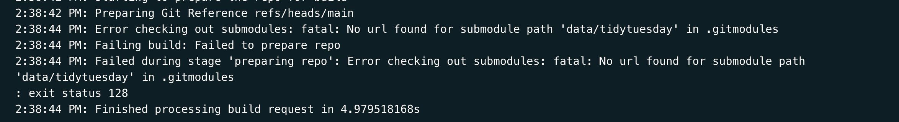
```

* First, identify where the offending `/.git/` directory is by navigating to the root project directory in the terminal then typing

```{bash, eval = FALSE}
find . -type d -name '.git'
```

which should return something like 

```
./git
./data/tidytuesday/.git
```


# Troubleshooting: Netlify gitmodules error 

We have to remove the offending `/.git/` directory. Do this in the terminal by typing (making sure to modify the path to the correct path returned by the `find` command -- `./data/tidytuesday/` in the example)

```{bash, eval = FALSE}
rm -rf ./path/to/.git
```

Then we remove the directory containing the `/.git/` directory we just removed from tracking by git using (notice the two `--`s before cached and the path returned by `find` )

```{bash, eval = FALSE}
git rm -rf --cached ./path/to/
```

Type 

```{bash, eval = FALSE}
git status
```
 
to confirm that the correct path has been deleted from tracking by git. Then add the deleted directory back into tracking by git with

```{bash, eval = FALSE}
git add ./path/to/
```

Then commit and push. Verify that the website builds correctly on Netlify


# Getting equations to horizontal scroll


Displaying equations using blogdown and the Academic template by default does not wrap the equation. To allow the equation box to scroll horizontally, modify the file `/themes/github.com/wowchemy/wowchemy-hugo-modules/wowchemy/assets/scss/custom.scss` to 
```{r comment='', echo = FALSE}
cat(readLines(here::here("themes", "github.com", "wowchemy", "wowchemy-hugo-modules", "wowchemy", "assets", "scss", "custom.scss")), sep = '\n')
```

