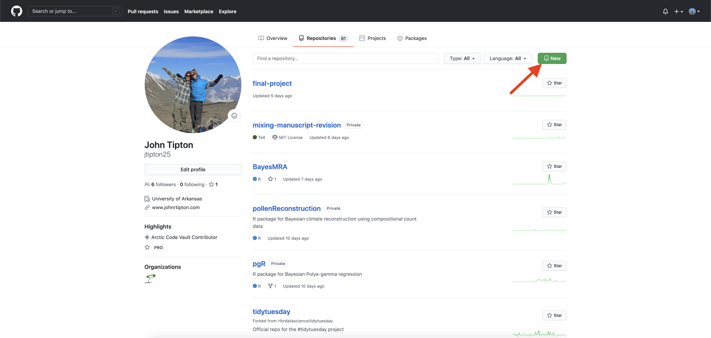

These instructions follow those at [https://happygitwithr.com/](https://happygitwithr.com/) -- chapters 7, 9, and 11. Another example of setting up and installing git for R [How to use Git with R and RStudio](https://www.geo.uzh.ch/microsite/reproducible_research/post/rr-rstudio-git/)
 
Note that all of the following commands **assume you are working in a linux/macOS system (not Windows)**. If you are a Windows user, follow the instructions at [https://happygitwithr.com/](https://happygitwithr.com/).  In addition, these instructions are subject to change and become out of date as the workflow changes. The references linked to above ([https://happygitwithr.com/](https://happygitwithr.com/)) are updated more regularly than those that follow.


First, if you haven't done so, create a gitHub account at [https://github.com](https://github.com/). gitHub will be your public code repository and will be an advertisement for your skills, knowledge, and abilities as a data scientist.


First, make sure the `usethis` packages are installed on your machine

```r
install.packages("usethis")
```

Next, open up a terminal window (either within RStudio or an independent window) and type

```
git config --global user.name 'Jane Doe'
git config --global user.email 'jane@example.com'
git config --global --list
```

where the `user.name` variable `'Jane Doe'` is changed to your gitHub username and the `user.email` variable `'jane@example.com'` is your email that you used to register to gitHub. These commands will store on your computer the variables for your username and email so that every time you interact with gitHub, you will not be required to enter this information.


# Setting up a gitHub SSH key

The next step is setup an SSH key with gitHub that makes it easy to sync your local repository with gitHub (and avoid typing your username and password over and over). To do this, open the terminal window and type

```bash
ssh-keygen -t rsa -b 4096 -C "USEFUL-COMMENT"
```

where you can change the text in "USEFUL-COMMENT" to describe what the key is. I use "statistical-methods-server" to distinguish this from my "home-desktop" and "work-desktop" computers.

At the prompt, accept the proposal to save the key in the default location. Just press `return` here:

```
Enter file in which to save the key (~/.ssh/id_rsa):
```


Next, you have the option to enter a passphrase for extra security. For now, skip this but for future work that might be sensitive, an additional passphrase can be useful (and can be saved in a password manager). To skip entering a passphrase, press `return` here. Once completed, the output should look something like:

```
jrtipton@statistical-methods ~ $ ssh-keygen -t rsa -b 4096 -C "statistical-methods-server"
Generating public/private rsa key pair.
Enter file in which to save the key (~/.ssh/id_rsa):     
Enter passphrase (empty for no passphrase): 
Enter same passphrase again: 
Your identification has been saved in ~/.ssh/id_rsa.
Your public key has been saved in ~/.ssh/id_rsa.pub.
The key fingerprint is:
SHA256:xh0TNYH+rHHwqQmdeDoki2xlpVhKm0n3vC87qIvp/cV USEFUL-COMMENT
The key's randomart image is:
+---[RSA 4096]----+
|     .=.o . +    |
|      o+   . .   |
|     ..= + +     |
|      .+* E      |
|   o.. = ..* .   |
|    .  +. = +    |
|  o ++=.o =o.    |
|     .= So =     |
| ..o.++o.=+.     |
+----[SHA256]-----+
```


Once you have generated the SSH key, the next step is to give the key to the ssh agent (which is a program that manages the key for you). Make sure the ssh agent is running by typing in the terminal:

```
eval "$(ssh-agent -s)"
```

which should return something like:

```
Agent pid 59566
```

Then, add your SSH key by typing in the terminal

```
ssh-add ~/.ssh/id_rsa
```


* get out your SSH key using RStudio

* Go to Tools > Global Options…> Git/SVN. If your key pair has the usual name, id_rsa.pub and id_rsa, RStudio will see it and offer to “View public key”. Do that and accept the offer to copy to your clipboard. If your key pair is named differently, use another method.

* Highlight and copy the text of the key making sure to copy the key starting with `ssh-rsa `    

* If there is no "View public key" option, you can go to the terminal and type

```bash
cat ~/.ssh/id_rsa
```

* copy the **entire output** (starting with ssh-rsa to the end) to your clipboard (ctrl-c) or using your mouse (right click)


* Make sure you’re signed into GitHub account and open the [gitHub site](https:://github.com) in your web browser.


Click on your profile pic in upper right corner and select Settings. See screenshot below.

```{r, echo = FALSE, fig.align = "center", out.width = "50%"}
 
```

Once you have navigated to your gitHub settings page, select the SSH and GPG keys option from the menu bar on the left hand side of the webpage.

```{r, echo = FALSE, fig.align = "center", out.width = "50%"}
 
```

On the SSH and GPG keys page, click the green "New SSH key" button on the top right of the page.

```{r, echo = FALSE, fig.align = "center", out.width = "50%"}
knitr::include_graphics("./images/92-new-ssh-keys.png") 
```

On the SSH key page, type in an informative description in the title, presumably related to the comment you used above in generating the SSH key during key creation (**link to section where this was done**). For example, you might use "Macbook Pro 2021". Now, use the copied key from section (**link to section where you copied the key**) and paste the key into the "Key" box. Then click "Add SSH key".


```{r, echo = FALSE, fig.align = "center", out.width = "50%"}
 
```


In theory, we’re done! To verify that your ssh key was suscessfully added to gitHub, Open up a terminal window and type

```
ssh -T git@github.com
```

to test your connection to GitHub (answer **yes** to continue). If you’re not sure what to make of the output, see the link for details. Of course, the best way to understand this process is to work through the process repeatedly using real world examples.


# Setting up your gitHub PAT

To access your gitHub repository, you will need a personal access token (PAT) -- see [here](https://happygitwithr.com/github-pat.html) for details about how to set this up as this is what I based the following tutorial on. 

* Log into the class server and install the `usethis` package

```r
install.packages("usethis")
```


Once the `usethis` package is installed, type

```r
usethis::browse_github_pat()
``` 

to open a webpage using your gitHub account (you will likely need to enter your password to continue).


```{r, echo = FALSE, fig.align = "center", out.width = "50%"}
knitr::include_graphics("./images/05-1-gitHub-PAT.png")
```


This will open up a webpage. On this webpage is a form to create your PAT with reasonable settings. Give the PAT a nickname and click "Generate token" and the token will be displayed. 

```{r, echo = FALSE, fig.align = "center", out.width = "50%"}
knitr::include_graphics("./images/06-gitHub-PAT.png")
```


The token is a string of 40 random letters and digits. Make sure you **copy this token to your clipboard** (`ctrl-c` on Windows and `cmd-c` on an Mac) as this is the last time you will be able to see it. You can also copy the token  by clicking on the clipboard symbol.


```{r, echo = FALSE, fig.align = "center", out.width = "50%"}
knitr::include_graphics("./images/07-gitHub-PAT.png")
```


Once you have generated a gitHub PAT and copied it to your clipboard, we will add the PAT to your `.Renviron` file. The goal is to add the following line in your `.Renviron` file:

```r
GITHUB_PAT=XXXXX
```

where the XXXX is the PAT copied from github. The `.Renviron` file is a hidden file that lives in your home directory and contains variables for `R` to load on the startup of `R`. 


The `.Renviron` file can be edited in `R` using the `usethis` package. In `R` type

```r
usethis::edit_r_environ()
```

```{r, echo = FALSE, fig.align = "center", out.width = "50%"}
knitr::include_graphics("./images/08-gitHub-PAT.png")
```

Your .Renviron file should pop up in your editor. Add your GITHUB_PAT as above,

```r
GITHUB_PAT=XXX
```

where the `XXXX` is the PAT copied from the GitHub site with a line break at the end of the file save the `.Renviron` file and close it. If questioned, YES you do want to use a filename that begins with a dot `.`. Note that, by default, most dotfiles are hidden in the RStudio file browser, but `.Renviron` should always be visible.


Restart `R` (Session > Restart R in the RStudio menu bar), as environment variables are loaded from `.Renviron` only at the start of an `R` session.

```{r, echo = FALSE, fig.align = "center", out.width = "50%"}
knitr::include_graphics("./images/09-gitHub-PAT.png")
```


Check that the PAT is now available like so:

```r
usethis::git_sitrep()
```

You should see the following line in the output:

```
Personal access token: '<found in env var>'
```

```{r, echo = FALSE, fig.align = "center", out.width = "50%"}

```

Now commands you run from the terminal and from RStudio, which consults GITHUB_PAT by default, will be able to access GitHub repositories which you have access to.


# Creating a repository on gitHub

Finally once you have setup your gitHub credentials, you are ready to create your first gitHub repository. First, goo to your gitHub webpage


```{r, echo = FALSE, fig.align = "center", out.width = "50%"}
knitr::include_graphics("./images/01-gitHub.png")
```


On the gitHub page, click the Repositories tab along the top bar.

```{r, echo = FALSE, fig.align = "center", out.width = "50%"}

```


Once you are on the Repositories page, click the green button in the upper right of the page to create a new repository. This will bring you to a new webpage where you will setup the repository. To create the repository, give the repository a name. I try to make my repository names short but meaningful. If you want, add a README to the repository. A README is a useful way of letting yourself (or other potential users) what your repository is all about. Then, click the green "create repository button" to create your repository on gitHub.

```{r, echo = FALSE, fig.align = "center", out.width = "70%"}
knitr::include_graphics("./images/03-gitHub.png")
```


Once you have setup your PAT (**link to PAT section**) and created a repository on gitHub, you can clone your created repository to the computer your are working on. This might be your personal computer or a shared computing resource like a server.  

On the gitHub webpage for your repository, click on the green button that says Code. Make sure you have the SSH tab highlighted in the drop down menu and click on the clipboard symbol to copy the address into your clipboard. For example, the address for my repository called `my-blog` is `https://github.com/jtipton25/my-blog.git`.

```{r, echo = FALSE, out.width = "60%", fig.show = 'hold'}
knitr::include_graphics("./images/server-project-ssh.png")
```

Open up the terminal and type `git clone` and then paste in the address copied from gitHub. My command looked like

```
git clone https://github.com/jtipton25/my-blog.git
```

where the exact site will depend on your gitHub username and repository name.


# Creating a Project in RStudio

* Now that you have cloned the repository from gitHub, we will create a project. Within RStudio, first makesure the `blogdown` library is installed (run `install.packages("blogdown")` if not). 

Then, a blog is created using

```r
blogdown::new_site(dir = "~/my-blog")
```

where "~/my-blog" is the filepath for the repository you cloned from gitHub.

* Congratulations! You have just created your first blog!


# Pushing the blog to gitHub

* open up the terminal and navigate to the directory your gitHub repository was cloned into

```
cd ~/my-blog
```

* check the status of the repository with 

```
git status
```

* My status at this point is:

```
On branch main
Your branch is up-to-date with 'origin/main'.
Untracked files:
  (use "git add <file>..." to include in what will be committed)

        .gitignore
        config.toml
        content/
        index.Rmd
        my-blog.Rproj
        static/
        themes/

nothing added to commit but untracked files present (use "git add" to track)
```


# Pushing the blog to gitHub

* Add all the files with 


```
git add .
```

* Commit all of the files (`-a`) with a message (`-m` to gitHub with

```
git commit -a -m 'first blog post'
```

* Push the files to the origin master branch with 

```
git push 
```


# Git push error (Troubleshooting)

* See [https://happygitwithr.com/ssh-keys.html#ssh-troubleshooting](https://happygitwithr.com/ssh-keys.html#ssh-troubleshooting) and [https://docs.github.com/en/free-pro-team@latest/github/using-git/changing-a-remotes-url](https://docs.github.com/en/free-pro-team@latest/github/using-git/changing-a-remotes-url)

If you get an error in the git push like this:

```
error: cannot run rpostback-askpass: No such file or directory
Username for 'https://github.com': 
```

type `ctrl-c` to exit and check the remote using the terminal with

```
git remote -v
```

* There are two types of remotes (HTTPS and SSH), we want a SSH remote.
    * HTTPS remotes: `https://github.com/USERNAME/REPOSITORY.git`
    * SSH remotes: `git@github.com:USERNAME/REPOSITORY.git`


# Git push error (Troubleshooting)

* If your remote is an HTTPS remote, change it to a SSH remote by going to the gitHub webpage and copying the SSH address (see [Cloning your gitHub repository](#clone-repo))

```{r, echo = FALSE, out.width = "60%", fig.show = 'hold'}
knitr::include_graphics("./images/server-project-ssh.png")
```

Then, change the remote URL to SSH using 

```
git remote set-url origin git@github.com:jtipton25/my-blog.git
```

where `git@github.com:jtipton25/my-blog.git` is changed to what your SSH remote is.


